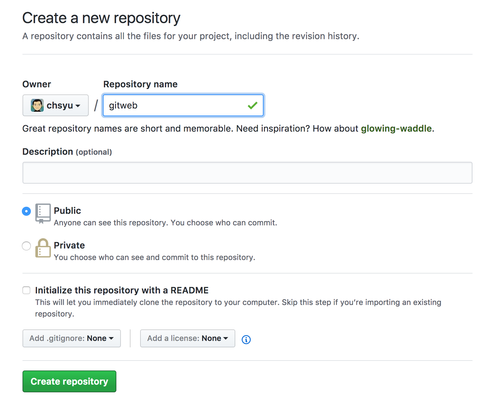
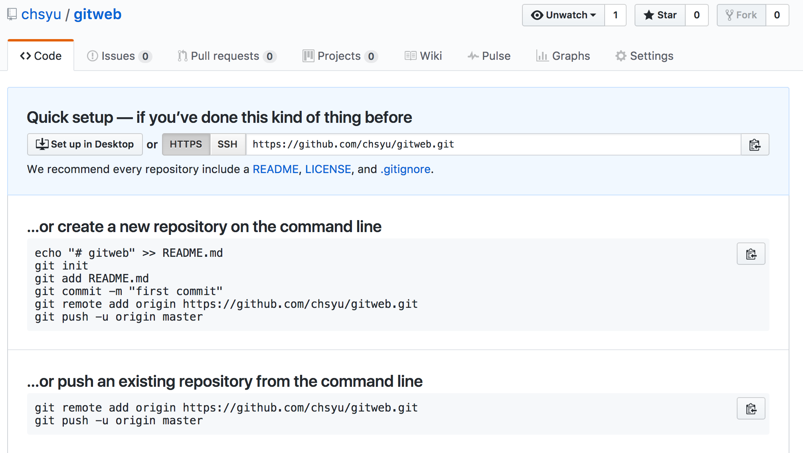
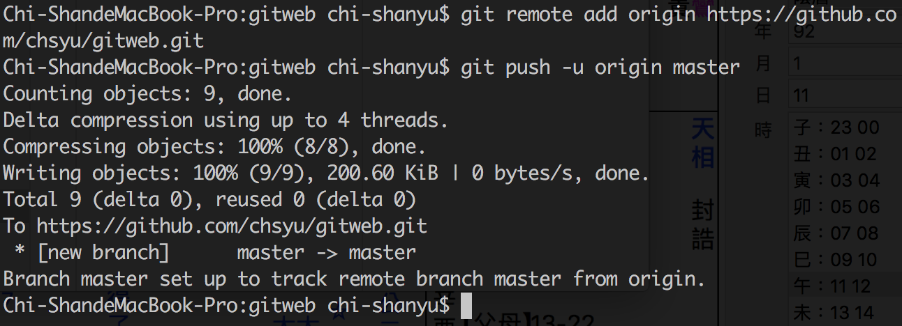
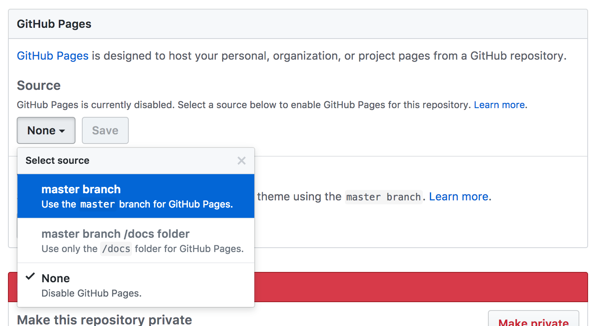
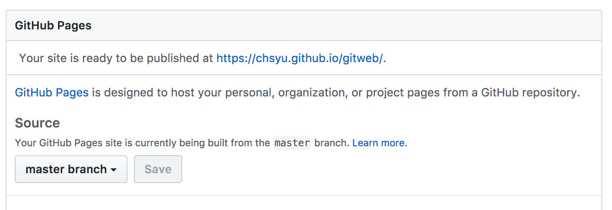
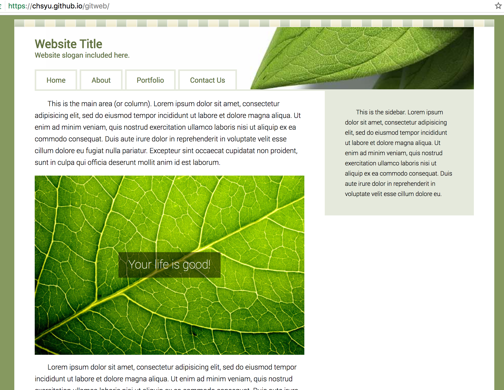

# 網頁上傳GIT
除了可以利用GIT進行網頁程式碼的版本控管，也可以利用GIT當成靜態網頁的伺服器，唯一的限制，就是html檔案的名稱必須是**index.html**

### 主要有三件事要做：

- 把網頁程式用git管理
- 把網頁程式推送到git （第一個作業）
- 把存在git的網頁用git page顯示（第二個作業）

### 把網頁程式用git管理
1）利用terminal確認一下網頁程式


2）利用```git --version```指令確認你已經安裝了git程式


3）利用```git init```指令把網頁程式用git管理版本


4）利用```git add```指令把所有的程式加入暫存


5）利用```git commit -m "getweb"```指令提交，就完成git管理網頁程式


### 把網頁程式推送到git
1）在github建立一個repository


2）隨你的專案取一個你喜歡的名字，並且要選定為Public


3）按下綠色的Create repository按鈕之後，就會出現這個Quick Setup畫面。因為我們的網頁已經在電腦端用git管理了，所以只要注意最下面的那兩行，把他複製到電腦的終端機(你在origin後面的專案路徑會與我這個不同)




```
git remote add origin https:///github.com/你的專案名稱
git push -u origin master
```



4）經過一小段時間之後，你的專案就被push到github。你在github的專案就可以看到網頁程式，**這一頁的url就是作業一，你也就完成第一個作業**。


### 把存在git的網頁用git page顯示
1）接下來，同樣是這一頁。注意選單有一個Settings按鈕，把他按下


2）按下Settings之後就會進入設定畫面，往下滑到GitHub Pages區域，按下select source，把原本的none改選為master branch


3）選定之後按下save，設定頁面就會重刷一次，再度滑到GitHub Pages區域，你會發現GitHub已經給你的這個Git網頁程式設定了一個超連結，**這個超連結，就是你要繳交的的二個作業**


4）點選超連結，就可以看到這個靜態網頁已經在GitHub伺服器了



